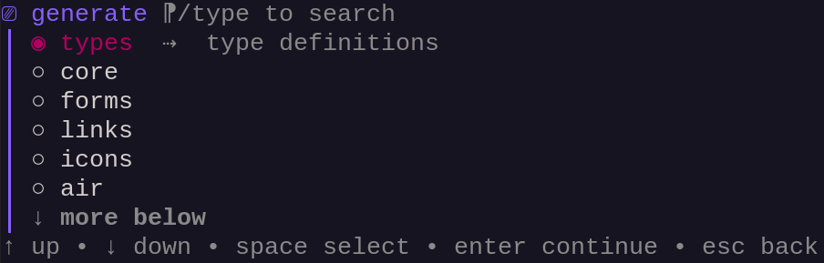

import { FileTree } from '@astrojs/starlight/components'

The cli provides various commands to manage your project lifecycle, from creation to deployment.

## Create Project

```sh
frizzante -cMyProject
# or
frizzante --create-project MyProject
```

Creates a new project in a new directory using the given name.

<FileTree>
    - MyProject
        - main.go
        - ...
        - app
            - index.html
            - ...
</FileTree>

## Generate

```sh
frizzante -g
# or
frizzante --generate
```

This command generates code and/or resources.

:::note
Many of frizzante's functionalities come as code and resource generations, not as libraries.
:::

:::tip
Use `:pick` to run the interactive menu.

```sh
frizzante -g:pick
```


:::

## Configure

```sh
frizzante --configure
```

Runs [--generate="air,bun"](#generate) and then [--install](#install).

This will generate [Air](https://github.com/air-verse/air) and [Bun](https://bun.sh/) binaries in `.gen/{air,bun}`.

<FileTree>
    - .gen
        - air
            - air
        - bun
            - bun
</FileTree>

## Install

```sh
frizzante -i
# or
frizzante --install
```

Installs Go and JavaScript packages from `go.mod` and `app/package.json`.

<FileTree>
    - go.mod
    - app
        - package.json
</FileTree>


:::note
JavaScript packages are installed using [.gen/bun/bin](#configure) by default.
You can point to a custom Bun binary of your choice by setting `--bun`.

For example, the following will install JavaScript packages using a `~/.bun/bun` binary

```sh
frizzante --bun="~/.bun/bun" --install
```

Alternatively you can also use a global binary.

```sh
frizzante --bun="bun" --install
```

This will force the cli to use the binary present in your path.
:::

## Update

```sh
frizzante -u
# or
frizzante --update
```

Updates Go and JavaScript packages from `go.mod` and `app/package.json`.

<FileTree>
    - go.mod
    - app
        - package.json
</FileTree>

:::caution
This will bump version numbers.
:::

:::note
JavaScript packages are updated using [.gen/bun/bin](#configure) by default.
You can point to a custom Bun binary of your choice by setting `--bun`.

For example, the following will update JavaScript packages using a `~/.bun/bun` binary

```sh
frizzante --bun="~/.bun/bun" --update
```

Alternatively you can also use a global binary.

```sh
frizzante --bun="bun" --update
```

This will force the cli to use the binary present in your path.
:::

## Package

```sh
frizzante -p
# or
frizzante --package
```

Runs `vite build` and `vite build --ssr` in order to package the the `app` directory into `app/dist`.

<FileTree>
    - app
        - dist
            - client
                - assets
                    - index-\{hash\}.css
                    - index-\{hash\}.js
                    - ...
                - index.html
            - server.js
</FileTree>

The output contains a `client` directory which can be simply served as is to the client and a `server.js` file that can be executed on the server in order to render the contents of the application in advanced.

:::note
Your app directory is packaged using [.gen/bun/bin](#configure) by default.
You can point to a custom Bun binary of your choice by setting `--bun`.

For example, the following will package your app using a `~/.bun/bun` binary

```sh
frizzante --bun="~/.bun/bun" --package
```

Alternatively you can also use a global binary.

```sh
frizzante --bun="bun" --package
```

This will force the cli to use the binary present in your path.
:::

## Package Watch

```sh
frizzante --package-watch
```

Runs [--package](#package) in watch mode.

:::note
This will detect changes made only in the `app` directory.
:::

## Dev

```sh
frizzante -d
# or
frizzante --dev
```

Runs [Air](https://github.com/air-verse/air) and [--package-watch](#package-watch) in parallel.

:::note
The cli uses [.gen/air/air](#configure) by default.
You can point to a custom Air binary of your choice by setting `--air`.

For example, the following will run air using a `~/.air/air` binary

```sh
frizzante --air="~/.air/air" --dev
```

You can also use a global binary.

```sh
frizzante --air="air" --dev
```

Or even use custom paths for both Air and Bun.

```sh
frizzante --air="air" --bun="bun" --dev
```

This will force the cli to use the binaries present in your path.
:::

## Build

```sh
frizzante -b
# or
frizzante --build
```

Runs [--package](#package) and then builds the Go program in `.gen/bin/app`.

<FileTree>
    - .gen
        - bin
            - app
</FileTree>

## Check

```sh
frizzante --check
```

Runs `eslint` and `svelte-check` in your `app` directory in order to detect code syntax and style errors.

:::note
Checks are run using [.gen/bun/bin](#configure) by default.
You can point to a custom Bun binary of your choice by setting `--bun`.

For example, the following will check your app using a `~/.bun/bun` binary

```sh
frizzante --bun="~/.bun/bun" --check
```

Alternatively you can also use a global binary.

```sh
frizzante --bun="bun" --check
```

This will force the cli to use the binary present in your path.
:::

## Format

```sh
frizzante -f
# or
frizzante --format
```

This will run `go fmt ./...` and `prettier --write .` in your `app` directory.

:::note
[Prettier](https://prettier.io/) is run using [.gen/bun/bin](#configure) by default.
You can point to a custom Bun binary of your choice by setting `--bun`.

For example, the following will format your app using a `~/.bun/bun` binary

```sh
frizzante --bun="~/.bun/bun" --format
```

Alternatively you can also use a global binary.

```sh
frizzante --bun="bun" --format
```

This will force the cli to use the binary present in your path.
:::

## Touch

```sh
frizzante --touch
```

Creates placeholder files in `app/dist`.

:::note
This is just a pure convenience command.

Go's `embed` directive requires files to exist at compile time, this command simply
creates some placeholders in your `app/dist` directory.
:::

## Clean Project

```sh
frizzante --clean-project
```

Removes directories `.gen`, `.vite`, `app/dist`, `app/node_modules` and then runs [--touch](#touch).

:::note
These are all files that can easily be recreated with `--configure` followed by `--package`.
:::

## Reset

```sh
frizzante --reset
```

Deletes frizzante's global cache.

:::note
The global cache is located at `~/.frizzante` by default.

:::tip
You can configure this location by setting `FRIZZANTE_HOME` to whatever path you want in your environment variables.
:::

## Additional Options

### Confirmation

```sh
frizzante -y
# or
frizzante --yes
```

Automatically confirms all prompts without user interaction. 

:::tip
This is useful for ci/cd pipelines, automated scripts, batch operations.
:::

### Version

```sh
frizzante -v
# or
frizzante --version
```

Displays the version of the binary.

### Help

```sh
frizzante -h
# or
frizzante --help
```

Shows the complete list of available commands and options.

### Interactive Mode

```sh
frizzante
```

Running `frizzante` without any flags starts an interactive menu where you can select commands using arrow keys. 

:::note
This is useful if
- you're learning the available commands
- you're not sure which command to use
- you prefer a guided interface
:::