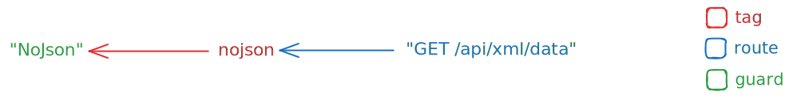
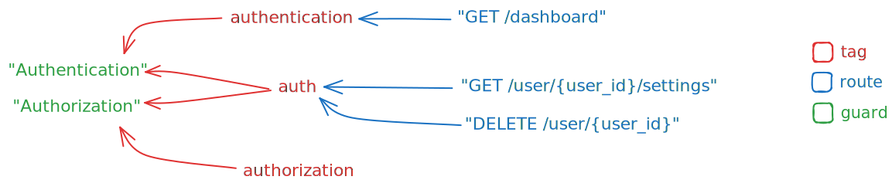

import { Tabs, TabItem } from '@astrojs/starlight/components'

You can protect your [routes](../routes) with guards.

A guard allows you to execute logic before a certain request reaches
a designated route handler.

Start by adding a guard to the server

```go
package main

import "github.com/razshare/frizzante/client"
import "github.com/razshare/frizzante/route"
import "github.com/razshare/frizzante/server"

var conf = server.Default()                                 // Creates server config.

func main() {
    defer server.Start(conf)                                // Starts server.
    conf.Guards = append(conf.Guards, {                     // Adds guard.
       Name: "No Json Allowed",                             // Sets guard name. It's useful for logs.
       Handler: func(c *client.Client, allow func()) {      // Sets guard handler.
          if receive.ContentType(c) == "application/json" { // If requests uses "application/json" content...
             return                                         // ..returns. This will actually terminate the connection.
          }
          allow()                                           // Allows request through.
       },
       Tags: []string{"nojson", "jsonless"},                // Sets guard tags.
    })
    conf.Routes = append(conf.Routes, route.Route{          // Adds route.
       Pattern: "GET /",                                    // Sets route pattern.
       Handler: func(c *client.Client) {
          send.Message(c, "Hello.")                         // Sends message..
       },
       Tags: []string{"nojson"},                            // Sets route tags. Any guard that intersects 
                                                            // with these tags will execute before any 
                                                            // request reaches the route's handler.
    })
}
```

A guard protects every route whose tags intersect with at least one of its own tags.

In this case, the `GET /` route intersects with the `No Json Allowed` guard in `nojson`, which means `GET /` is protected by `No Json Allowed`.



## Composition

Multiple guards can intersect in order to compose more advanced restrictions.

```go
conf.Guards = append(conf.Guards, {                 // Adds guard.
    Name: "Authorization",                          // Sets guard name. It's useful for logs.
    Handler: func(c *client.Client, allow func()) { // Sets guard handler. If allow() is never invoked, 
                                                    // the guard will reject the request.
       a := receive.Header(c, "Authorization")      // Gets "Authorization" header from the request.
       if !SuperAdvancedAuthorizationCheckTM(a) {   // If client is not authorized...
          send.Status(c, 403)                       // ...sends status 403...
          send.Message(c, "Not authorized.")        // ...and a short message with an explanation.
          return                                    // Returns. This will actually terminate the connection.
       }
       allow()                                      // Allows request through.
    },
    Tags: []string{"authorization", "auth"},        // Sets guard tags.
})
```

```go
conf.Guards = append(conf.Guards, {                   // Adds guard.
    Name: "Authentication",                           // Sets guard name. It's useful for logs.
    Handler: func(c *client.Client, allow func()) {   // Sets guard handler. If allow() is never invoked, 
                                                      // the guard will reject the request.
       session := session.Start(receive.SessionId(c)) // Starts session.
       if !session.SignedIn {                         // If the user is not signed in...
          send.Status(c, 403)                         // ...sends status 403...
          send.Message(c, "Not authenticated.")       // ...and a short message with an explanation.
          return                                      // Returns. This will actually terminate the connection.
       }
       allow()                                        // Allows request through.
    },
    Tags: []string{"authentication", "auth"},         // Sets guard tags.
})
```

```go
conf.Guards = append(conf.Guards, {   // Adds route.
    Pattern: "GET /",                 // Sets route pattern.
    Handler: func(c *client.Client) { // Sets route handler.
       send.Message(c, "Hello.")      // Sends message..
    },
    Tags: []string{"auth"},           // Sets route tags. Any guard that intersects 
                                      // with these tags will execute before any 
                                      // request reaches the route's handler.
})
```

In this case, `GET /` is protected by both `Authentication` and `Authorization` guards because they all intersect int `auth`.




:::tip
You can still apply each guard separately with tags `authorization` and `authentication`.

<Tabs>
    <TabItem icon='open-book' label='Authorization'>
       ```go
       conf.Guards = append(conf.Guards, {  // Adds route.
          Pattern: "GET /",                 // Sets route pattern.
          Handler: func(c *client.Client) { // Sets route handler.
             send.Message(c, "Hello.")      // Sends message..
          },
          Tags: []string{"authorization"},  // Sets route tags. Any guard that intersects 
                                            // with these tags will execute before any 
                                            // request reaches the route's handler.
       })
       ```
    </TabItem>
    <TabItem icon='open-book' label='Authentication'>
       ```go
       conf.Guards = append(conf.Guards, {  // Adds route.
          Pattern: "GET /",                 // Sets route pattern.
          Handler: func(c *client.Client) { // Sets route handler.
             send.Message(c, "Hello.")      // Sends message..
          },
          Tags: []string{"authentication"}, // Sets route tags. Any guard that intersects 
                                            // with these tags will execute before any 
                                            // request reaches the route's handler.
       })
       ```
    </TabItem>
</Tabs>
:::