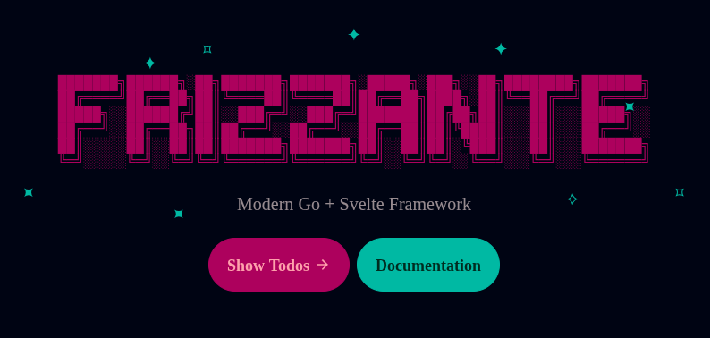

The starter template comes with a todos application.



## Main

The server defines a few routes.

```go
//main.go
func main() {
    defer servers.Start(server)
    server.Efs = efs
    server.Routes = []routes.Route{
        {Pattern: "GET /", Handler: fallback.View},
        {Pattern: "GET /welcome", Handler: welcome.View},
        {Pattern: "GET /todos", Handler: todos.View},
        {Pattern: "POST /toggle", Handler: todos.Toggle},
        {Pattern: "POST /add", Handler: todos.Add},
        {Pattern: "POST /remove", Handler: todos.Remove},
    }
}
```

## Fallback

The `GET /` pattern acts as a fallback.


With that in mind, the fallback handler tries to send back a 
matching file or the `"Welcome"` view using `send.RequestedFile()`.

```go
//lib/routes/fallback/view.go
func View(client *clients.Client) {
    if !send.RequestedFile(client) {
        welcome.View(client)
    }
}
```

## Welcome View

The `"Welcome"` view, among other things, renders a hyperlink pointing to `"GET /todos"`.

```go
//lib/routes/welcome/view.go
func View(client *clients.Client) {
    send.View(client, views.View{Name: "Welcome"})
}
```

```svelte
//app/lib/views/Welcome.svelte
<Layout title="Welcome">
    <Logo />
    {@render Description()}
    <div class="pt-6"></div>
    <div class="flex justify-center gap-2 relative">
        {@render BackgroundEffect()}
        {@render TodosButton()}
        {@render DocumentationButton()}
    </div>
</Layout>
```

```svelte
//app/lib/views/Welcome.svelte
{#snippet TodosButton()}
    <a class="btn btn-primary btn-lg" {...href("/todos")}>
        <span>Show Todos</span>
        <Icon path={mdiArrowRight} size="18" />
    </a>
{/snippet}
```

## Todos View

The `"GET /todos"` pattern is then captured by a Go handler function, which sends back 
the `"Todos"` view along with a list of items retrieved from the user's session.

```go
//lib/routes/todos/view.go
func View(client *clients.Client) {
    session := sessions.Start(receive.SessionId(client))
    defer func() { session.Error = "" }()
    send.View(client, views.View{Name: "Todos", Props: Props{
        Error: session.Error,
        Items: session.Todos,
    }})
}
```

:::note
The user session is initialized with a few items.

```go
//lib/sessions/new.go
func New() *Session {
    return &Session{
        Todos: []Todo{
            {Checked: false, Description: "Pet the cat."},
            {Checked: false, Description: "Do laundry"},
            {Checked: false, Description: "Pet the cat."},
            {Checked: false, Description: "Cook"},
            {Checked: false, Description: "Pet the cat."},
        },
    }
}
```
:::


The `"Todos"` view is a [CRUD](https://en.wikipedia.org/wiki/Create,_read,_update_and_delete) web ui.

```svelte
<script lang="ts">
    //...
    import type { Props, Todo } from "$gen/types/main/lib/routes/todos/Props"
    let { todos = [], error }: Props = $props()
    //...
</script>
```

```svelte
//app/lib/views/Todos.svelte
<Layout title="Todos">
    <div class="w-full min-w-[450px] max-w-2xl">
        <div class="text-center">
            {@render Description()}
        </div>
        <div class="card-body relative p-6">
            {@render AddTodoForm()}
            <div class="divider"></div>
            {@render ShowTodosList(todos)}
            {@render BackButton()}
        </div>
    </div>
</Layout>
```

### List Todos

Items are listed by iterating over `todos`.

```svelte
//app/lib/views/Todos.svelte
{#snippet ShowTodosList(todos: sessions.Todo[])}
    {#if todos.length > 0}
        {#each todos as todo, index (index)}
            <div in:slide out:slide class="flex w-full text-base-content/80">
                {@render ToggleTodoButton(todo, index)}
                {@render RemoveTodoButton(index)}
            </div>
        {/each}
        {@render CountUncheckedTodos()}
    {:else}
        {@render NoTodosFound()}
    {/if}
{/snippet}
```

Each item has remove and toggle buttons.

:::note
Type `sessions.Todo` is an autogenerated type definition.\
See [type definitions](../type-definitions).
:::

### Remove Todos

Items are removed by submitting a form to `"POST /remove"`.

```svelte
//app/lib/views/Todos.svelte
{#snippet RemoveTodoButton(index: number)}
    <form method="POST" {...action("/remove")}>
        <input type="hidden" name="index" value={index} />
        <button
            type="submit"
            class="btn btn-ghost btn-sm btn-square hover:text-error hover:bg-error/20 transition-colors"
            aria-label="Delete"
        >
            <Icon path={mdiClose} size="18" />
        </button>
    </form>
{/snippet}
```

:::tip
If you need more control over errors and pending states 
see [Form Component](../web-standards/#form-component).
:::

The form is then captured by the `Remove` handler,
which does some basic validation, error handling 
and then finally removes the item from the session.

```go
//lib/routes/todos/types.go
type RemoveForm struct {
    Index int `form:"index"`
}
```

```go
//lib/routes/todos/remove.go
func Remove(client *clients.Client) {
    session := sessions.Start(receive.SessionId(client))

    var form RemoveForm
    if !receive.Form(client, &form) {
        session.Error = "could not parse form"
        send.Navigate(client, "/todos")
        return
    }

    if count := len(session.Todos); form.Index >= count || form.Index < 0 {
        session.Error = "index out of bounds"
        send.Navigate(client, "/todos")
        return
    }

    session.Todos = append(
        session.Todos[:form.Index],
        session.Todos[form.Index+1:]...,
    )

    send.Navigate(client, "/todos")
}
```

### Toggle Todos

Items are toggled by submitting a form to `"POST /toggle"`.

```svelte
//app/lib/views/Todos.svelte
{#snippet ToggleTodoButton(todo: Todo, index: number)}
    {@const aria = todo.checked ? "Uncheck" : "Check"}
    {@const value = todo.checked ? "0" : "1"}
    {@const icon = todo.checked ? mdiCheckCircleOutline : mdiCircleOutline}
    <form {...action("/toggle")} class="grow content-center">
        <input type="hidden" name="index" value={index} />
        <input type="hidden" name="value" {value} />
        <button
            type="submit"
            class="w-full flex cursor-pointer"
            class:line-through={todo.checked}
            class:text-base-content={todo.checked}
            class:opacity-50={todo.checked}
            aria-label={aria}
        >
            <Icon path={icon} />
            <div class="pr-4"></div>
            <span>{todo.description}</span>
        </button>
    </form>
{/snippet}
```

The form is then captured by the `Toggle` handler.

```go
//lib/routes/todos/types.go
type ToggleForm struct {
    Index int `form:"index"`
    Value int `form:"value"`
}
```

```go
//lib/routes/todos/toggle.go
func Toggle(client *clients.Client) {
    session := sessions.Start(receive.SessionId(client))

    var form ToggleForm
    if !receive.Form(client, &form) {
        session.Error = "could not parse form"
        send.Navigate(client, "/todos")
    }

    if count := len(session.Todos); form.Index >= count || form.Index < 0 {
        session.Error = "index out of bounds"
        send.Navigate(client, "/todos")
        return
    }

    session.Todos[form.Index].Checked = form.Value > 0

    send.Navigate(client, "/todos")
}
```

### Add Todos

Items are added by submitting a form to `POST /add`.

```svelte
//lib/views/Todos.svelte
{#snippet AddTodoForm()}
    <form {...action("/add")} class="flex">
        <input
            type="text"
            name="description"
            placeholder="Add a new task..."
            class="input bg-base-100/ text-lg w-full"
        />
        <div class="pt-4"></div>
        <button type="submit" class="btn btn-ghost text-lg">
            <Icon path={mdiPlus} size="20" />
            <span>Add</span>
        </button>
    </form>

    {#if error}
        <div class="pt-4"></div>
        <div in:slide out:slide class="alert alert-error">
            <span>{error}</span>
        </div>
    {/if}
{/snippet}
```

The form is then captured by the `Add` handler.

```go
//lib/routes/todos/types.go
type AddForm struct {
    Description string `form:"description"`
}
```

```go
//lib/routes/todos/add.go
func Add(client *clients.Client) {
    session := sessions.Start(receive.SessionId(client))

    var form AddForm
    if !receive.Form(client, &form) {
        session.Error = "could not parse form"
        send.Navigate(client, "/todos")
        return
    }

    if form.Description == "" {
        session.Error = "description cannot be empty"
        send.Navigate(client, "/todos")
        return
    }

    session.Todos = append(session.Todos, sessions.Todo{
        Checked:     false,
        Description: form.Description,
    })

    send.Navigate(client, "/todos")
}
```

## More Examples

| Description | Hyperlink |
|-------------|-----------|
| A live chat application | https://github.com/razshare/frizzante-example-chat |
| A blog application with login and registration forms | https://github.com/razshare/frizzante-example-blog |