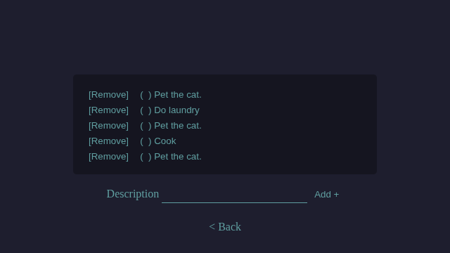
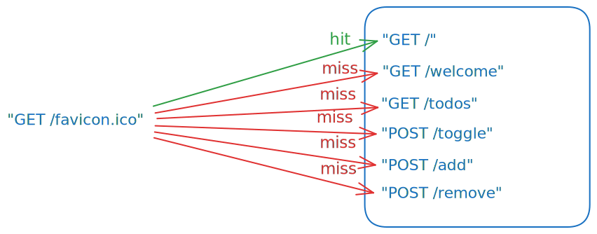
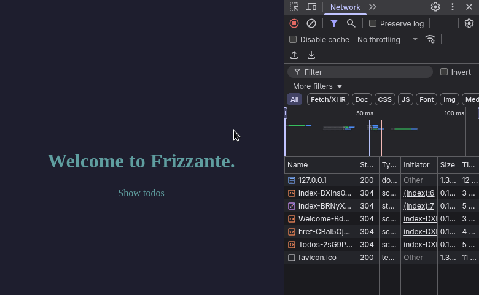
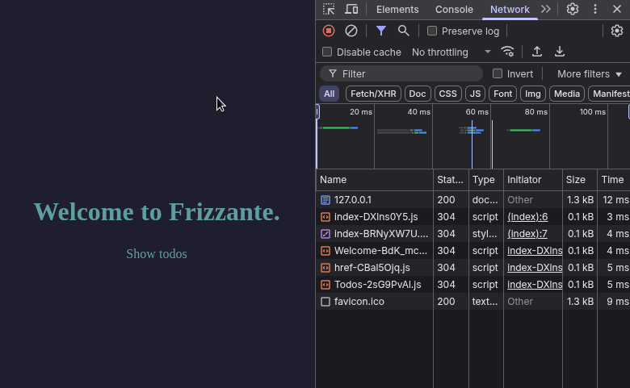
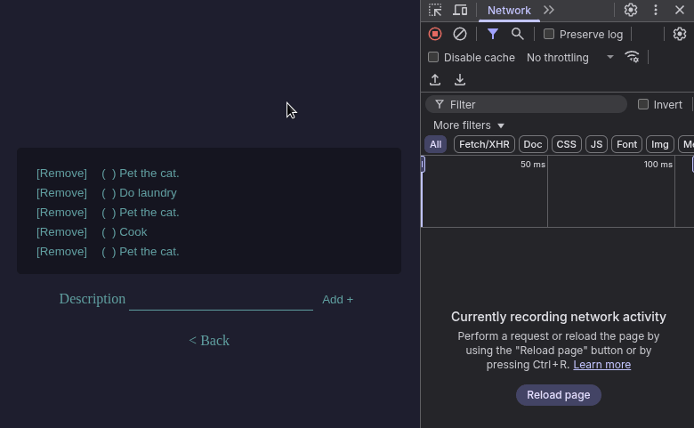
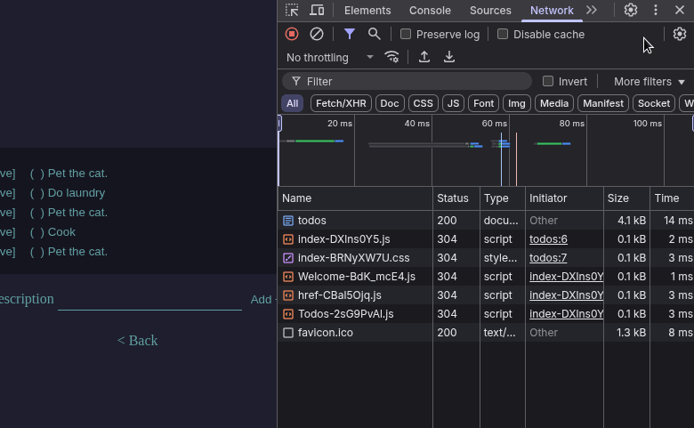

The starter template comes with a todos application.

You can find this example at https://github.com/razshare/frizzante-starter.



Although the application itself is simple, there are many 
things that might need some explanation.

## Main

First of all every interaction happens through a `GET` verb.

```go
//main.go
package main

import (
	"embed"
	"github.com/razshare/frizzante/route"
	"github.com/razshare/frizzante/server"
	"main/lib/routes/handlers/fallback"
	"main/lib/routes/handlers/todos"
	"main/lib/routes/handlers/welcome"
)

//go:embed app/dist
var efs embed.FS
var conf = server.Default()

func main() {
	defer server.Start(conf)
	conf.Container.Efs = efs
	conf.Routes = []route.Route{
		{Pattern: "GET /", Handler: fallback.View},
		{Pattern: "GET /welcome", Handler: welcome.View},
		{Pattern: "GET /todos", Handler: todos.View},
		{Pattern: "GET /check", Handler: todos.Check},
		{Pattern: "GET /uncheck", Handler: todos.Uncheck},
		{Pattern: "GET /add", Handler: todos.Add},
		{Pattern: "GET /remove", Handler: todos.Remove},
	}
}
```

As you can see, all handlers are exposed with a `GET /...` pattern.

## Default

The `Default` handler is exposed with a `GET /` pattern, 
which acts as a fallback handler.



It is for that reason that this handler tries to send a matching file
with `send.FileOrElse()` before doing anything else.

```go
//lib/routes/handlers/fallback/view.go
func View(c *client.Client) {
    send.FileOrElse(c, func() { View(c) })
}
```

:::note
This handler essentially acts as a file server and falls back to `Welcome`.
:::

## Welcome Handler

All this handler does is send the `"Welcome"` view to the client with `send.View()`.

```go
//lib/routes/handlers/welcome/view.go
func View(c *client.Client) {
    send.View(c, view.View{Name: "Welcome"})
}
```

This `"Welcome"` view is exported by the application for both the client and the server.

```ts
//app/exports/server.ts
import Welcome from "$lib/views/Welcome.svelte"
import Todos from "$lib/views/Todos.svelte"

export const views = {
    "Welcome": Welcome, // Exporting "Welcome".
    "Todos": Todos,
}
```

```ts
//app/exports/client.ts
export const views = {
    "Welcome": import("$lib/views/Welcome.svelte"), // Exporting "Welcome".
    "Todos": import("$lib/views/Todos.svelte"),
}
```

These are key/value records.

The keys are important, because they dictate the `Name` of the view, the actual property `Name` of the view.

```go
view.View{
    Name: "Welcome", // This.
}
```

## Welcome View

The `"Welcome"` view is simply laying down a header message and a link pointing 
to `"/todos"`.

```svelte
//app/lib/views/Welcome.svelte
<script lang="ts">
    import Layout from "$lib/components/Layout.svelte"
    import { href } from "$frizzante/scripts/href.ts"
</script>

<Layout title="Welcome">
    <h1>Welcome to Frizzante.</h1>
    <a class="link" {...href("/todos")}> Show todos </a>
</Layout>
```

This hyperlink is a bit special, because it doesn't just specify an `href` attribute
as you would normally expect.

Instead it uses the `href()` function to set said attribute.

This is because in reality `href()` also returns a `onclick` handler.

```ts
//frizzante/scripts/href.ts
export function href(path = ""): {
    href: string
    onclick: (e: MouseEvent) => void
}
```

When the view is allowed to execute JavaScript inside the users's browser,
the hyperlink will swap the view dynamically instead 
of navigating away to the given path.



However, if the view is not allowed to execute JavaScript code, then
the hyperlink will fallback to using web standards, 
and it will navigate away to the given path when clicked.



:::tip
There are several reason as to when and why a view can't execute JavaScript code.

Although rare, a client might choose to disable JavaScript altogether on your
website.

The server itself could choose to not serve a JavaScript bundle to the client.

```go
view.View{
    Name: "Welcome",
    // This will disable JavaScript.
    RenderMode: view.RenderModeServer,
}
```

Another reason might be if, for some reason, your JavaScript bundle is broken, or
not compatible with the client's browser. In that case there's still a good chance that
the hyperlink will continue to work by falling back to its standard behavior.
:::

:::tip
If you need more control over errors and pending states 
see [Link Component](../web-standards/#link-component).
:::

## Todos Handler

It sends the `"Todos"` view to the client, along with a list of todos, which is
retrieved from the session state.

```go
//lib/routes/handlers/todos/view.go
func View(c *client.Client) {
    s := session.Start(receive.SessionId(c))
    send.View(c, view.View{
       Name: "Todos",
       Data: map[string]any{
          "todos": s.Todos,
       },
    })
}
```

By default the session state has a few items in it.

```go
//lib/session/start.go
var Sessions = map[string]*Session{}

func Start(id string) *Session {
    v, ok := Sessions[id]
    if !ok {
       Sessions[id] = &Session{Todos: []Todo{
          {Checked: false, Description: "Pet the cat."},
          {Checked: false, Description: "Do laundry"},
          {Checked: false, Description: "Pet the cat."},
          {Checked: false, Description: "Cook"},
          {Checked: false, Description: "Pet the cat."},
       }}
       return Sessions[id]
    }
    return v
}

```

## Todos View

The `"Todos"` view does quite a few things.

1. Lists Items
1. Removes items.
1. Checks items.
1. Unchecks items.
1. Adds items.

```svelte
//app/lib/views/Todos.svelte
<script lang="ts">
    import Layout from "$lib/components/Layout.svelte"
    import { href } from "$frizzante/core/scripts/href.ts"
    import {action} from "$frizzante/core/scripts/action.ts";

    type Todo = {
       Checked: boolean
       Description: string
    }

    type Props = {
       todos: Todo[]
       error: string
    }

    let { todos, error }: Props = $props()
</script>

<Layout title="Todos">
    <ol>
       {#each todos as todo, index (index)}
          <li>
             <form {...action("/remove")}>
                <input type="hidden" name="index" value={index} />
                <button class="link">[Remove]</button>
             </form>
             {#if todo.Checked}
                <form {...action("/uncheck")}>
                    <input
                       type="hidden"
                       name="index"
                       value={index}
                    />
                    <button class="link">
                       <!---->
                       (x) {todo.Description}
                       <!---->
                    </button>
                </form>
             {:else}
                <form {...action("/check")}>
                    <input
                       type="hidden"
                       name="index"
                       value={index}
                    />
                    <button class="link">
                       <!---->
                       (&nbsp;&nbsp;) {todo.Description}
                       <!---->
                    </button>
                </form>
             {/if}
          </li>
       {/each}
    </ol>
    <form {...action("/add")}>
       <span class="link">Description</span>
       <input type="text" value="" name="description" />
       <button class="link" type="submit">Add +</button>
    </form>

    {#if error}
       <br />
       <span class="error">{error}</span>
    {/if}

    <br />
    <a class="link" {...href("/")}>&lt; Back</a>
</Layout>
```

###### Listing Items

The component itself receives the todo list 
as a `todos` property from the server

```ts
//app/lib/views/Todos.svelte
let {todos, error}:Props = $props()
```

which is then iterated upon to render the items

```svelte
//app/lib/views/Todos.svelte
{#each todos as todo, index (index)}
    <li>
       <form {...action("/remove")}>
          <input type="hidden" name="index" value={index} />
          <button class="link">[Remove]</button>
       </form>
       {#if todo.Checked}
          <form {...action("/uncheck")}>
             <input
                type="hidden"
                name="index"
                value={index}
             />
             <button class="link">
                <!---->
                (x) {todo.Description}
                <!---->
             </button>
          </form>
       {:else}
          <form {...action("/check")}>
             <input
                type="hidden"
                name="index"
                value={index}
             />
             <button class="link">
                <!---->
                (&nbsp;&nbsp;) {todo.Description}
                <!---->
             </button>
          </form>
       {/if}
    </li>
{/each}
```

Each item has two buttons, a **remove button** and a **toggle** button.

###### Removing Items

Removing an item from the list involves submitting a form to `/remove`, along with the
index of the item, which is hidden.

```svelte
//app/lib/views/Todos.svelte
<form {...action("/remove")}>
    <input type="hidden" name="index" value={index} />
    <button class="link">[Remove]</button>
</form>
```

This action is then captured by the `Remove` handler,
which does some basic validation, error handling 
and then finally removes the item from the session.

:::tip
Similarly to `href()`, the `action()` function adapts the form.

In essence, forms behave similarly to hyperlinks, in that when submitted,
they naturally navigate away to a new path, the `action` path.

When JavaScript is enabled, `action()` makes it so that instead of navigating away
and reloading the whole page, the form will swap the view locally.



On the other hand, if JavaScript is disabled, the form will fallback to web standards
and behave like any other form, navigating away to the new path.


:::

:::tip
If you need more control over errors and pending states 
see [Form Component](../web-standards/#form-component).
:::

```go
//lib/routes/handlers/todos/remove.go
func Remove(c *client.Client) {
	s := session.Start(receive.SessionId(c))

	l := int64(len(s.Todos))
	if 0 == l {
		// No index found, ignore the request.
		send.Navigate(c, "/todos")
		return
	}

	is := receive.Query(c, "index")
	if is == "" {
		// No index found, ignore the request.
		send.Navigate(c, "/todos")
		return
	}

	i, e := strconv.ParseInt(is, 10, 64)
	if nil != e {
		send.View(c, view.View{
			Name: "Todos",
			Data: map[string]any{
				"error": e.Error(),
			},
		})
		return
	}
	if i >= l {
		// Index is out of bounds, ignore the request.
		send.Navigate(c, "/todos")
		return
	}

	s.Todos = append(
		s.Todos[:i],
		s.Todos[i+1:]...,
	)

	send.Navigate(c, "/todos")
}
```

:::caution
Notice the use of `receive.Query(c, "index")`.

This is a reminder that, if not specified otherwise, 
forms prefer using the `GET` verb.

The equivalent using the `POST` verb would be

```svelte
//app/lib/views/Todos.svelte
<form method="POST" {...action("/remove")}>
    <input type="hidden" name="index" value={index} />
    <button class="link">[Remove]</button>
</form>
```

```go
//lib/routes/handlers/todos/Remove.go
// ...
f := receive.Form(c)
is := f.Get("index")
// ...
```
:::

###### Checking & Unchecking Items

Checking and unchecking items is also done using forms.

```svelte
//app/lib/views/Todos.svelte
{#if todo.Checked}
    <form {...action("/uncheck")}>
       <input type="hidden" name="index" value={index} />
       <button class="link">
          <!---->
          (x) {todo.Description}
          <!---->
       </button>
    </form>
{:else}
    <form {...action("/check")}>
       <input type="hidden" name="index" value={index} />
       <button class="link">
          <!---->
          (&nbsp;&nbsp;) {todo.Description}
          <!---->
       </button>
    </form>
{/if}
```

Checking an item sends a form to `/check` and unchecking it sends the form to `/uncheck`.

Both forms indicate the index of the item using a hidden input field.

```svelte
//lib/views/Todos.svelte
<input type="hidden" name="index" value={index} />
```

Checking is handled by the `Check` handler.

```go
//lib/routes/handlers/todos/check.go
func Check(c *client.Client) {
	s := session.Start(receive.SessionId(c))

	is := receive.Query(c, "index")
	if is == "" {
		// No index found, ignore the request.
		send.Navigate(c, "/todos")
		return
	}

	i, e := strconv.ParseInt(is, 10, 64)
	if nil != e {
		send.View(c, view.View{
			Name: "Todos",
			Data: map[string]any{
				"error": e.Error(),
			},
		})
		return
	}

	l := int64(len(s.Todos))
	if i >= l {
		// Index is out of bounds, ignore the request.
		send.Navigate(c, "/todos")
		return
	}

	s.Todos[i].Checked = true

	send.Navigate(c, "/todos")
}
```

While unchecking is handled by the `Uncheck` handler, which does the exact same thing
as `Check`, except it sets `Checked` to `false` instead of `true`.

```go
//lib/routes/handlers/todos/uncheck.go
// ...
s.Todos[i].Checked = false
// ...
```

###### Adding Items

The final piece of the puzzle is adding items to the list, which is done
by sending a form to `/add`.

```svelte
//lib/views/Todos.svelte
<form {...action("/add")}>
    <span class="link">Description</span>
    <input type="text" value="" name="description" />
    <button class="link" type="submit">Add +</button>
</form>
```

This form is then captured by the `Add` handler.

```go
//lib/routes/handlers/todos/add.go
func Add(c *client.Client) {
	s := session.Start(receive.SessionId(c))
	d := receive.Query(c, "description")
	if d == "" {
		send.View(c, view.View{
			Name: "Todos",
			Data: map[string]any{
				"todos": s.Todos,
				"error": "todo description cannot be empty",
			},
		})
		return
	}

	s.Todos = append(s.Todos, session.Todo{
		Checked:    false,
		Description: d,
	})

	send.Navigate(c, "/todos")
}
```

## More Examples

| Description | Hyperlink |
|-------------|-----------|
| A live chat application | https://github.com/razshare/frizzante-example-chat |
| A blog application with login and registration forms | https://github.com/razshare/frizzante-example-blog |