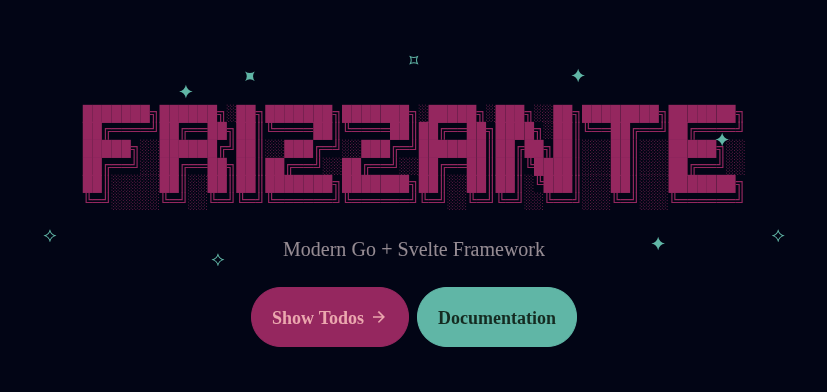

The starter template comes with a todos application.



## Main

For the sake of simplicity, every interaction happens through a `GET` verb.

```go
//main.go
func main() {
	defer server.Start(srv)
	srv.Efs = efs
	srv.Render = render
	srv.Routes = []route.Route{
		{Pattern: "GET /", Handler: fallback.View},
		{Pattern: "GET /welcome", Handler: welcome.View},
		{Pattern: "GET /todos", Handler: todos.View},
		{Pattern: "GET /toggle", Handler: todos.Toggle},
		{Pattern: "GET /add", Handler: todos.Add},
		{Pattern: "GET /remove", Handler: todos.Remove},
	}
}
```

As you can see, all handlers are exposed with a `GET /...` pattern.

## Fallback

The `GET /` pattern acts acts as a fallback.


With that in mind, the fallback handler tries to send back a 
matching file or the `"Welcome"` view using `send.FileOrElse()`.

```go
//lib/routes/handlers/fallback/view.go
func View(client *client.Client) {
    send.FileOrElse(client, func() { welcome.View(client) })
}
```

## Welcome View

The `"Welcome"` view, among other things, renders a hyperlink pointing to `"GET /todos"`.

```go
//lib/routes/handlers/welcome/view.go
func View(client *client.Client) {
    send.View(client, view.View{Name: "Welcome"})
}
```

```svelte
//app/lib/views/Welcome.svelte
<Layout title="Welcome">
    {@render Description()}
    <div class="pt-6"></div>
    <div class="flex justify-center gap-2 relative">
        {@render Sparkles()}
        {@render TodosButton()}
        {@render DocumentationButton()}
    </div>
</Layout>
```

```svelte
//app/lib/views/Welcome.svelte
{#snippet TodosButton()}
    <a class="btn btn-primary btn-lg" {...href("/todos")}>
        <span>Show Todos</span>
        <Icon path={mdiArrowRight} size="18" />
    </a>
{/snippet}
```

## Todos View

The `"GET /todos"` pattern is then captured by a Go handler function, which sends back 
the `"Todos"` view along with a list of items retrieved from the user's session state.

```go
//lib/routes/handlers/todos/view.go
func View(client *client.Client) {
	state := session.Start(receive.SessionId(client))
	send.View(client, view.View{
		Name: "Todos",
		Props: Props{
			Todos: state.Todos,
			Error: receive.Query(client, "error"),
		},
	})
}
```

:::note
The user session state is initialized with a few items.

```go
//lib/session/memory/start.go
var States = map[string]*State{}

func Start(id string) *State {
	if state, ok := States[id]; ok {
		return state
	}

	States[id] = New()
	return States[id]
}
```

```go
//lib/session/memory/new.go
func New() *State {
	return &State{
		Todos: []Todo{
			{Checked: false, Description: "Pet the cat."},
			{Checked: false, Description: "Do laundry"},
			{Checked: false, Description: "Pet the cat."},
			{Checked: false, Description: "Cook"},
			{Checked: false, Description: "Pet the cat."},
		},
	}
}
```
:::


The `"Todos"` view is a [CRUD](https://en.wikipedia.org/wiki/Create,_read,_update_and_delete) web ui.

```svelte
<script>
   let { Todos = [], Error }: Props = $props()
</script>
```

```svelte
//app/lib/views/Todos.svelte
<Layout title="Todos">
    <div class="w-full min-w-[450px] max-w-2xl">
        <div class="text-center">
            {@render Description()}
        </div>
        <div class="card-body relative p-6">
            {@render Add()}
            <div class="divider"></div>
            {#if Todos.length === 0}
                {@render Empty()}
            {:else}
                {#each Todos as todo, index (index)}
                    {@render Todo(todo, index)}
                {/each}
            {/if}
            {#if Todos.length > 0}
                {@render Remaining()}
            {/if}
            {@render Back()}
        </div>
    </div>
</Layout>
```

### List Todos

Items are listed by iterating over `Todos`.

```svelte
//app/lib/views/Todos.svelte
{#each Todos as todo, index (index)}
   {@render Todo(todo, index)}
{/each}
```
```svelte
//app/lib/views/Todos.svelte
{#snippet Todo(todo: Todo, index: number)}
    <div in:slide out:slide class="flex w-full text-base-content/80">
        {@render Toggle(todo, index)}
        {@render Remove(index)}
    </div>
{/snippet}
```

Each item has remove and toggle buttons.

### Remove Todos

Items are removed by submitting a form to `"GET /remove"`.

```svelte
//app/lib/views/Todos.svelte
{#snippet Remove(index: number)}
    <form {...action("/remove")}>
        <input type="hidden" name="index" value={index} />
        <button
            type="submit"
            class="btn btn-ghost btn-sm btn-square hover:text-error hover:bg-error/20 transition-colors"
            aria-label="Delete"
        >
            <Icon path={mdiClose} size="18" />
        </button>
    </form>
{/snippet}
```

:::tip
If you need more control over errors and pending states 
see [Form Component](../web-standards/#form-component).
:::

The form is then captured by the `Remove` handler,
which does some basic validation, error handling 
and then finally removes the item from the session.

```go
//lib/routes/handlers/todos/remove.go
func Remove(client *client.Client) {
	var err error
	var index int64
	var count int64
	var query string
	var state *session.State

	state = session.Start(receive.SessionId(client))

	if query = receive.Query(client, "index"); query == "" {
		// No index found, ignore the request.
		send.Navigate(client, "/todos")
		return
	}

	if index, err = strconv.ParseInt(query, 10, 64); err != nil {
		send.Navigatef(client, "/todos?error=%s", err.Error())
		return
	}

	if count = int64(len(state.Todos)); index >= count || index < 0 {
		// Index is out of bounds, ignore the request.
		send.Navigate(client, "/todos")
		return
	}

	state.Todos = append(
		state.Todos[:index],
		state.Todos[index+1:]...,
	)

	send.Navigate(client, "/todos")
}
```

### Toggle Todos

Items are toggled by submitting a form to `"GET /toggle"`.

```svelte
//app/lib/views/Todos.svelte
{#snippet Toggle(todo: Todo, index: number)}
    {@const aria = todo.Checked ? "Uncheck" : "Check"}
    {@const value = todo.Checked ? "0" : "1"}
    {@const icon = todo.Checked ? mdiCheckCircleOutline : mdiCircleOutline}
    <form {...action("/toggle")} class="grow content-center">
        <input type="hidden" name="index" value={index} />
        <input type="hidden" name="value" {value} />
        <button
            type="submit"
            class="w-full flex cursor-pointer"
            class:line-through={todo.Checked}
            class:text-base-content={todo.Checked}
            class:opacity-50={todo.Checked}
            aria-label={aria}
        >
            <Icon path={icon} />
            <div class="pr-4"></div>
            <span>{todo.Description}</span>
        </button>
    </form>
{/snippet}
```

The form is then captured by the `Toggle` handler.

```go
//lib/routes/handlers/todos/toggle.go
func Toggle(client *client.Client) {
	var err error
	var index int64
	var value int64
	var count int64
	var queryIndex string
	var queryValue string
	var state *session.State

	state = session.Start(receive.SessionId(client))

	if queryIndex = receive.Query(client, "index"); queryIndex == "" {
		// No index found, ignore the request.
		send.Navigate(client, "/todos")
		return
	}

	if queryValue = receive.Query(client, "index"); queryValue == "" {
		// No index found, ignore the request.
		send.Navigate(client, "/todos")
		return
	}

	if index, err = strconv.ParseInt(queryIndex, 10, 64); err != nil {
		send.Navigatef(client, "/todos?error=%s", err.Error())
		return
	}

	if value, err = strconv.ParseInt(queryValue, 10, 64); err != nil {
		send.Navigatef(client, "/todos?error=%s", err.Error())
		return
	}

	if count = int64(len(state.Todos)); index >= count || index < 0 {
		// Index is out of bounds, ignore the request.
		send.Navigate(client, "/todos")
		return
	}

	state.Todos[index].Checked = value > 0

	send.Navigate(client, "/todos")
}
```

### Add Todos

Items are added by submitting a form to `GET /add`.

```svelte
//lib/views/Todos.svelte
{#snippet Add()}
    <form {...action("/add")} class="flex">
        <input
            type="text"
            name="description"
            placeholder="Add a new task..."
            class="input bg-base-100/ text-lg w-full"
        />
        <div class="pt-4"></div>
        <button type="submit" class="btn btn-ghost text-lg">
            <Icon path={mdiPlus} size="20" />
            <span>Add</span>
        </button>
    </form>

    {#if Error}
        <div class="pt-4"></div>
        <div in:slide out:slide class="alert alert-error">
            <span>{Error}</span>
        </div>
    {/if}
{/snippet}
```

The form is then captured by the `Add` handler.

```go
//lib/routes/handlers/todos/add.go
func Add(client *client.Client) {
	var query string
	var state *session.State

	state = session.Start(receive.SessionId(client))

	if query = receive.Query(client, "description"); query == "" {
		send.Navigate(client, "/todos?error=todo description cannot be empty")
		return
	}

	state.Todos = append(state.Todos, session.Todo{
		Checked:     false,
		Description: query,
	})

	send.Navigate(client, "/todos")
}
```